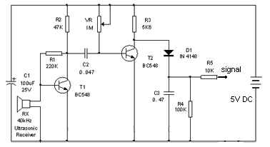
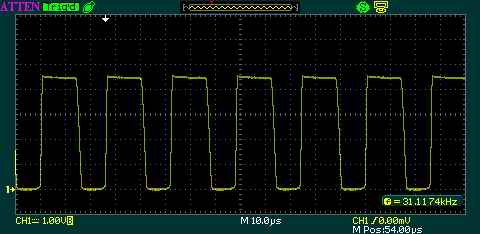

Séance 14

J'ai commencé à monter un premier récepteur. Ci-dessous le schéma électrique du récepteur :

    <figcaption align="center"><i>Figure 1: Schéma électrique du récepteur</i>
        
    </figcaption>

En faisant les branchements pour faire un premier test  sur la breadboard, j'ai fait beaucoup d'erreurs de branchement parce que j'ai passé beaucoup de temps à souder l'émetteur et je commençais à confondre les connections de la breadboard et celles que j'allais réaliser avec de l'étain. J'ai corrigé les erreurs de branchement.

Après avoir corrigé tous les branchements, j'ai fait mes premiers tests avec le duo émetteur-récepteur. Grâce à Ronan, j'ai réalisé que la soudure de l'émetteur avait un court-circuit. J'avais un signal qui sortait et qui semblait être bon (parce que je pensais que du fait que j'utilise un transistor légèrement différent de celui qui est sur le schéma électrique, le signal allait être un peu différent), sauf que ce n'était pas le bon signal.
J'ai enlevé le court-circuit, mais il n'y avait plus de signal. Après avoir regardé les tensions sur à peu près tous les composants, j'ai vu qu'étrangement la tension aux bornes du condensateur 22nF était de 0V. J'ai désouder ce-dernier et je l'ai remplacé par un nouveau.
La tension aux bornes du condensateur n'est plus de 0. Résultat : le signal en sortie de l'émetteur est parfait.

En continuant les tests, en plaçant l'émetteur en face du récepteur, j'obtiens le signal ci-dessous avant la diode de l'émetteur :

    <figcaption align="center"><i>Figure 2: Signal que mon récepteur reçoit<i>
        
    </figcaption>

Et voici le signal que je suis censé obtenir :

    <figcaption align="center"><i>Figure 3: Signal que je suis censé obtenir</i>
        
    </figcaption>

J'obtiens un résultat très satisfaisant.
Lorsque je lis le signal sur le fil Signal du schéma électrique, j'obtiens une tension qui varie en fonction de la distance entre l'émetteur et le récepteur.

Je peux alors retirer les composants de la breadboard et les souder. Après avoir fait ça, j'ai remarqué que le signal reçu faiblit trop vite. Il faut donc que je concentre les ondes, par exemple dans un tube, afin "d'amplifier la tension reçue" pour qu'elle soit perceptible par les pins analogiques d'Arduino.
En plus de ça, je dois souder de manière plus compacte les autres récepteurs, celui que je viens de souder est trop volumineux.

Je me pose des questions sur l'utilité du potentiomère 1M. Lorsque je le tourne à 0, j'obtiens un signal plus facilement perceptible que si je le tourne en direction de 1M. Je pense le remplacer par un simple fil, mais avant ça il faut que je vois avec Christian Peter.
 