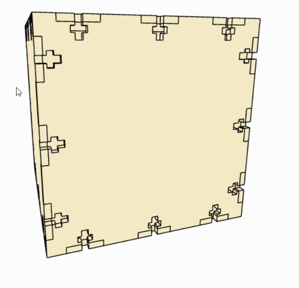

Le deuxième robot qu'il me restait commence à se casser sur sa face droite.
J'ai alors décidé de construire une autre version du corps du robot avec des encoches en T comme sur la Figure 1 suivante:

    

    <i>Figure 1: forme du nouveau corps du robot</i>

Le seul incovénient est que ce modèle est plus long à construire, parce que je dois aussi découper séparément les jonctions entre les faces et les coller. Il faut que je dois précis sur la taille des jonctions, si elles sont un tout petit peu trop grandes je dois forcer pour les rentrer, ce qui peut endommager mes faces.

J'ai également imprimé en 3D les cônes pour mes récepteurs.