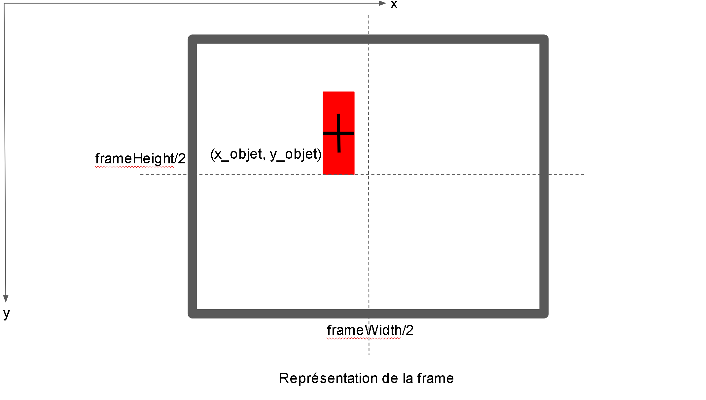
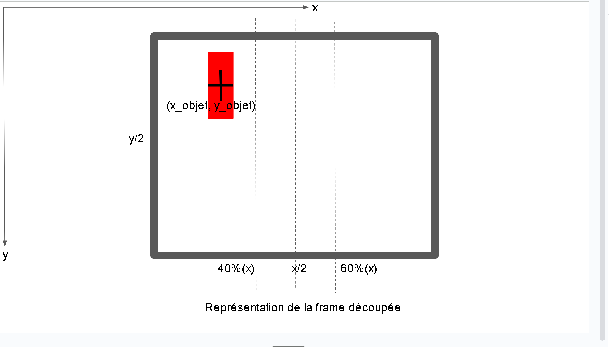

Seance 19

J'ai essayé de travailler avec les récepteurs et l'émetteur que j'avais. J'ai connecté le pin Signal d'un des récepteurs que j'avais soudés à une entrée analogique d'Arduino, et en faisant analogRead j'ai toujours eu la valeur 0, ce qui n'est pas ce que je veux. J'ai aussi décidé de ne pas utiliser les récepteurs que j'ai pris au projet des PeiP2, parce qu'ils sont trop longs (en terme de longueur), je veux des récepteurs assez plats pour que mon robot reste petit. Du coup je vais devoir tous les souder, mais Koralie pourra m'aider.
De plus, les soudures des câbles ont encore cassé, même avec les câbles Arduino. Je suis allé au FabLab et j'ai trouvé des fils encore plus solides. Je les ai utilisés et j'espère qu'ils ne vont pas casser.
Je voulais aussi voir pourquoi j'obtenais 0, j'ai utilisé l'oscilloscope pour visualiser les signaux de mon émetteur et de mon récepteur. Le signal émetteur est bien correct. Le signal à l'anode de la diode est aussi correct. Mais le signal après la diode est à 0, et je ne sais pas du tout pourquoi.

En ce qui concerne les déplacements de mon robot vers l'objet que je cible, je vais d'abord expliquer la représentation de la figure 1 ci-dessous:

    

    <i>Figure 1: Représentation de l'image dans la Pixy</i>

Pour plus de simplicité, je vais poser à frameWidth/2 = x/2 (+ marge) et frameHeight/2 = y/2 (+ marge).
L'objet est un block rectangulaire, dans mes tests c'était un baton de colle. Je me refère à l'objet grâce à son centre. Le but est de centrer le rectangle au milieu de la frame. Je suppose que mon objet est suffisamement loin, i.e. que mon objet est à y_objet <
J'ai programmé les déplacemens comme suit:
Tant que je ne suis pas à la distance de l'objet qui convient, je me déplace en y tant que y_objet n'est 
pas à y/2 avec une marge. Puis une fois que j'atteins y/2, je centre en x: tant que x_objet est plus petit que x/2, je tourne à droite, tant que x_objet est supérieur à x/2, je tourne à gauche.
Sauf que ça ne marche pas. J'ai eu l'impression que les déplacements étaient aléatoires. Et j'ai peut-être trouvé pourquoi. Premièrement, l'hypothèse que l'objet soit suffisamment loin est fausse. En fait, lorsqu'on regarde la Pixy pendant les déplacements du robot, la Pixy ne détecte pas "loin". L'objet est très souvent détecté lorsque y_objet > y/2. Deuxièmement, pour exactement les mêmes deux frames successives, aux micro-variations de luminosité près dûes à l'environnement, la détection du rectangle n'est pas la même. Le rectangle détecté oscille entre plusieurs positions (qui restent néanmoins proches), ce qui change son centre et crée de l'aléaoire.
J'ai demandé de l'aide à Sebastien Rothhut et il m'a conseillé de découper ma frame en zone d'actions comme ceci:

    

    <i>Figure 2: Représentation de l'image découpée en zones d'action dans la Pixy</i>

Maintenant, je découpe mon image en plusieurs zones sur x:
- de 0 à 40% (zone 1)
- de 40% à 60% (zone 2)
- de 60% à 100% (zone 3)

Si mon objet est dans la zone 1, je tourne à gauche.
Si mon objet est dans la zone 3, je tourne à droite.
Si mon objet est dans la zone 2, "le centre", je continue tout droit jusqu'à atteindre la distance pour attraper mon objet.

Ce nouvel algorithme est composé d'un while et de 3 if imbriqués, ce qui est beaucoup plus facile qu'un while et 3 while imbriqués.
De plus, je n'ai qu'à travailler que sur l'axe x.
J'ai fait des tests, et l'algorithme est très concluant: mon robot se déplace bien vers mon objet et s'arrête bien à la distance que je lui indique.